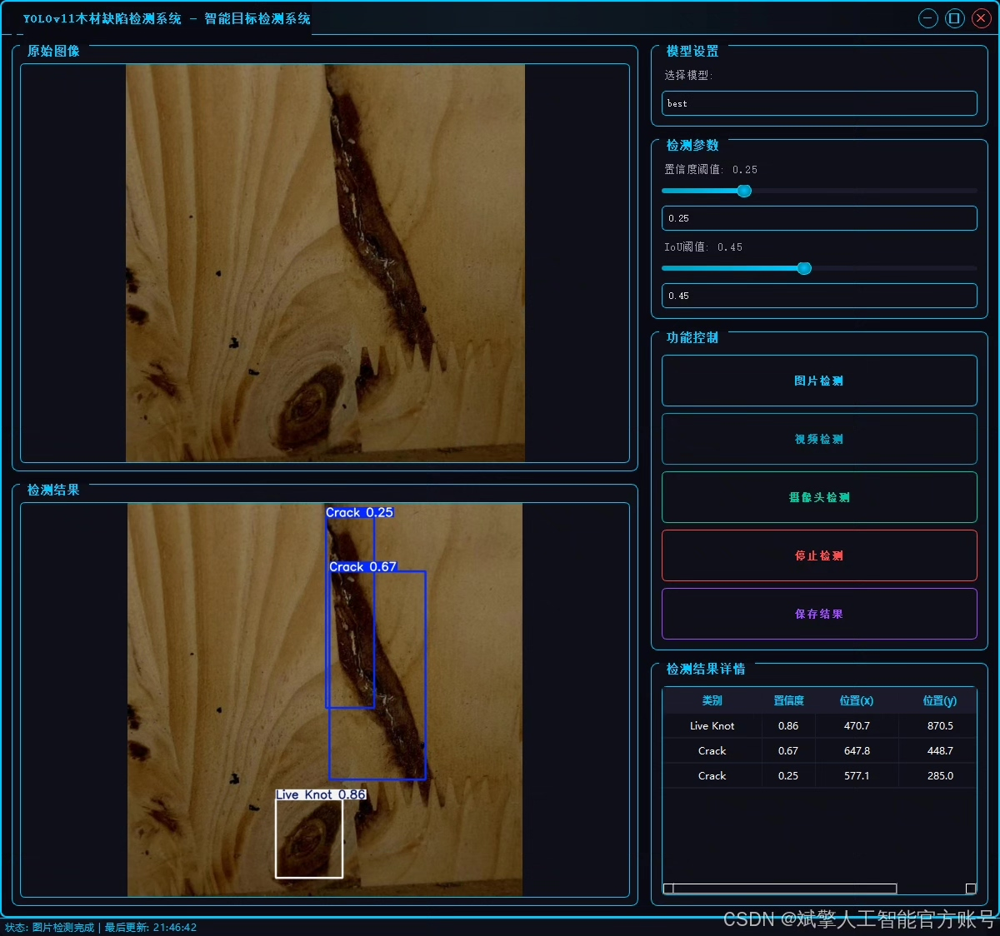
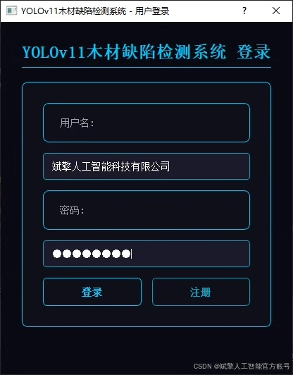
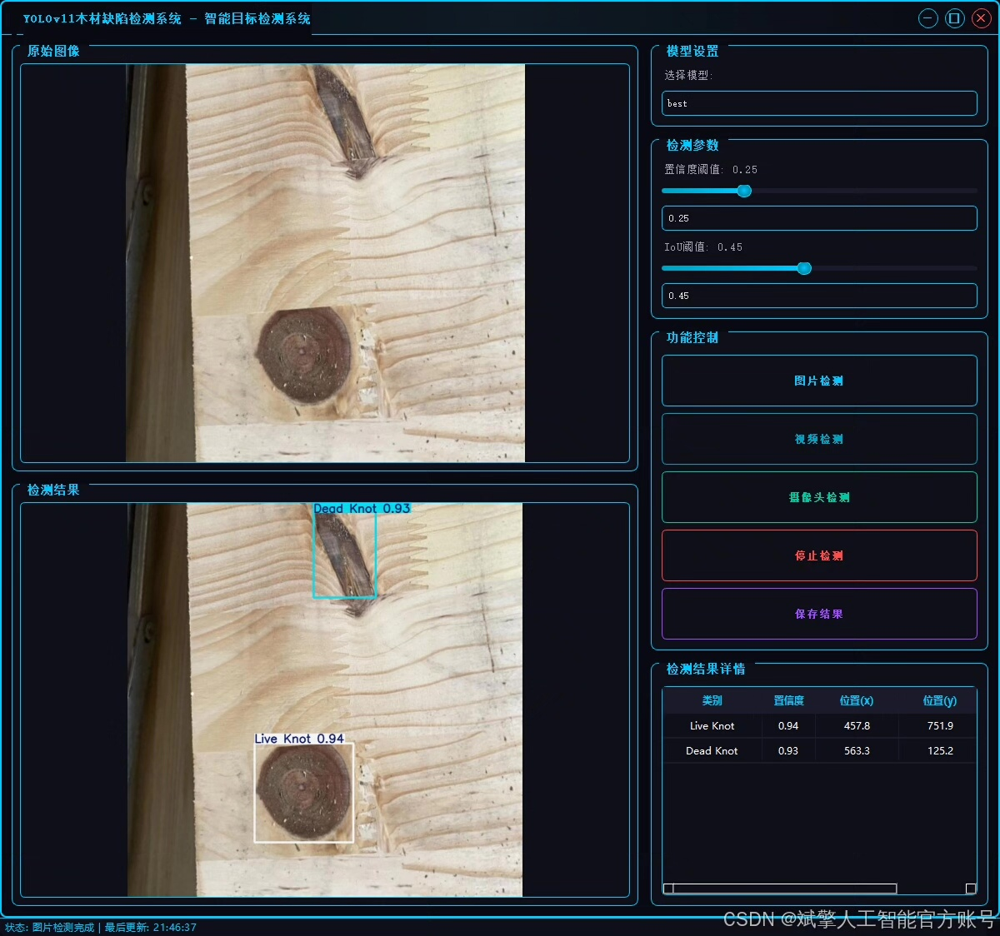
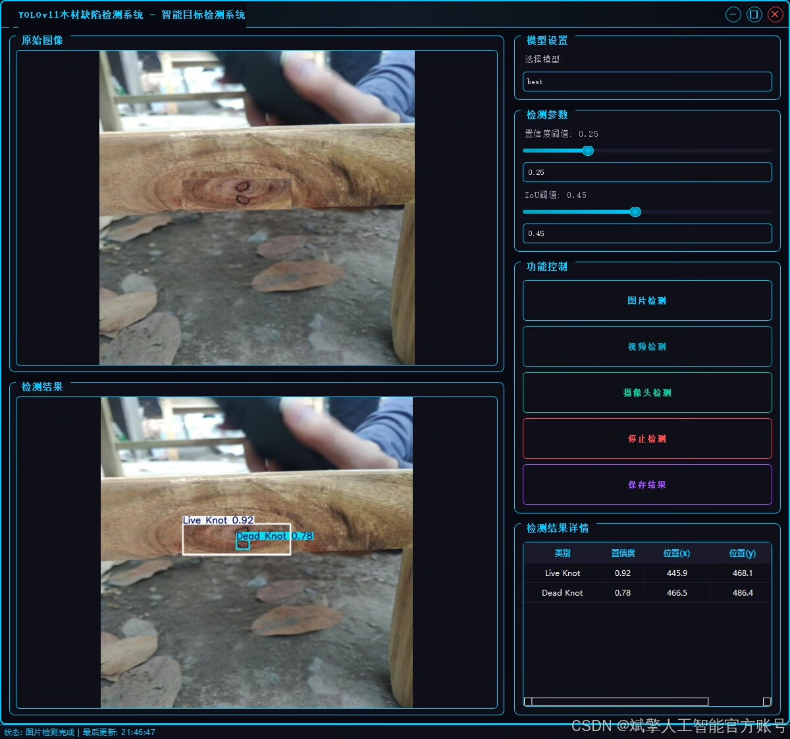
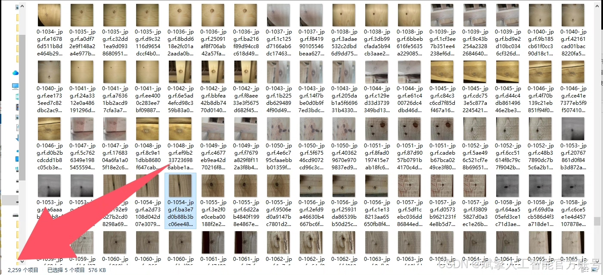
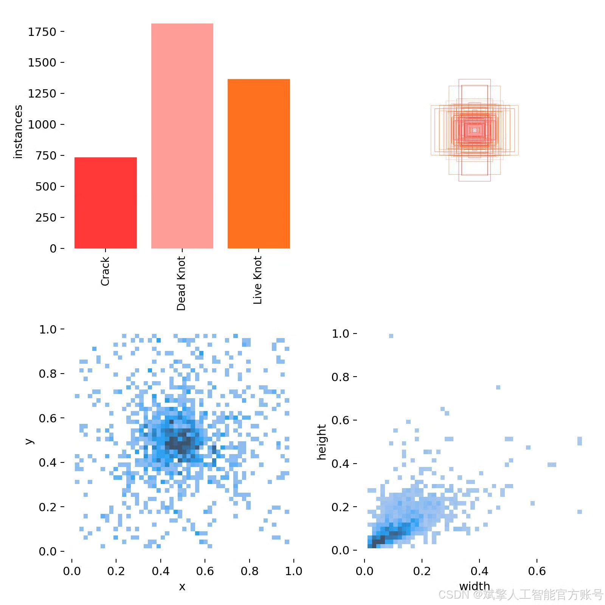
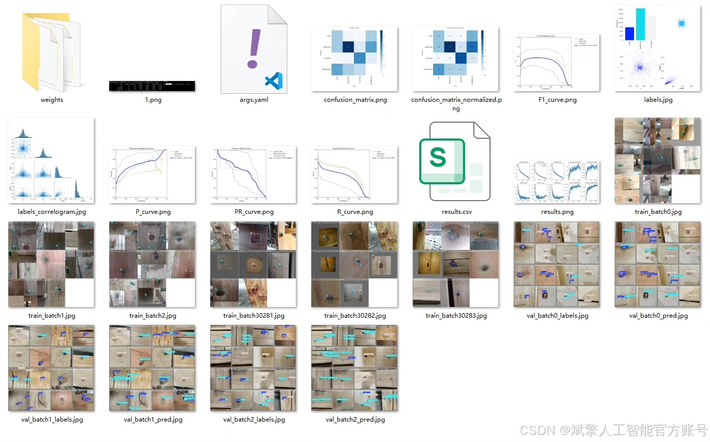
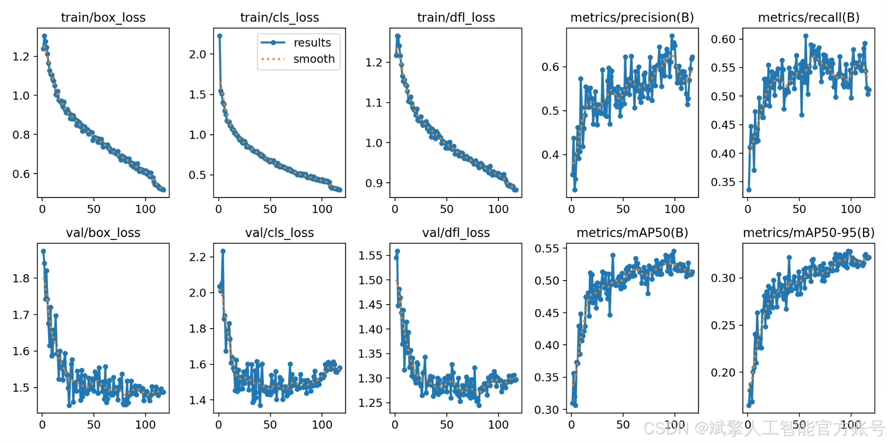
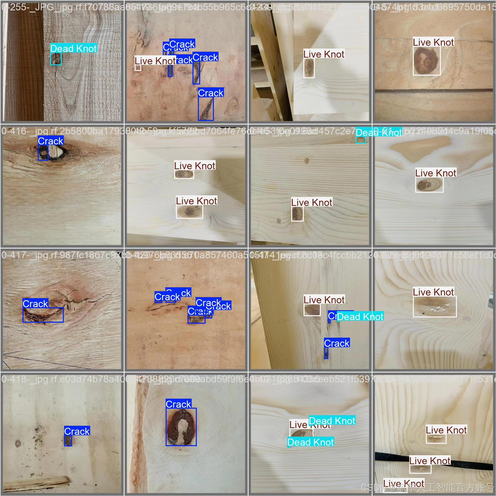

# YOLOv11 Wood Defect Detection System

## Body

YOLOv11 Wood Defect Detection System Based on Deep Learning YOLOv11, the Wood Defect Detection System (YOLOv11+YOLO dataset + UI interface + login and registration interface + Python project source code + model)

Wood defect detection is a key link in wood processing and quality control. Traditional manual detection methods are inefficient and easily influenced by subjective factors. This paper proposes a wood defect detection system based on deep learning technology, capable of efficiently identifying three common defects: cracks, dead knots, and live knots. The system uses a custom YOLO dataset containing 2,259 training images, 173 validation images, and 174 test images for model training, combined with a user-friendly UI interface and login/registration functions. Experimental results show that the system has high detection accuracy and robustness on the test set, providing a feasible solution for intelligent quality inspection in the wood industry.

Dataset:
nc: 3
names: ['Crack', 'Dead Knot', 'Live Knot'],
dataset quantity: training set 2259 images, validation set 173 images, test set 174 images

✅ User login registration: Supports password verification and security validation.
✅ Three detection modes: Based on the YOLOv11 model, supports image, video, and real-time camera detection, accurately recognizing targets.
✅ Dual-screen comparison: Display original images and detection results on the same screen.
✅ Data visualization: Real-time table displaying the category, confidence, and coordinates of detected targets.
✅ Intelligent parameter adjustment: Offers a confidence slide bar to dynamically optimize detection accuracy, adapting to different scene requirements.
✅ Sci-fi style interactive interface: Dark theme paired with dynamic light effects, reducing visual fatigue and improving operational experience.

## Images

## Payment

Here is a pay link on Stripe ( https://buy.stripe.com/3cs8yP7sY87d0vu9AB ). Please contact me lonlonago@foxmail.com after funding $89, and I will send you a complete data files , thank you!

